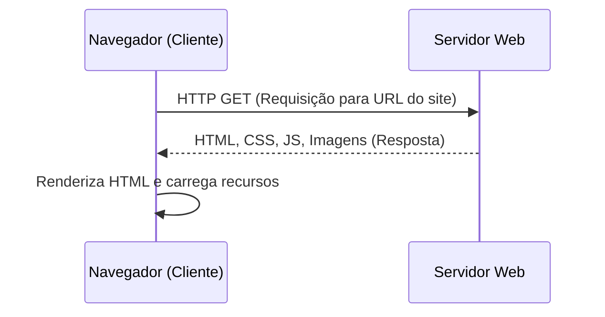
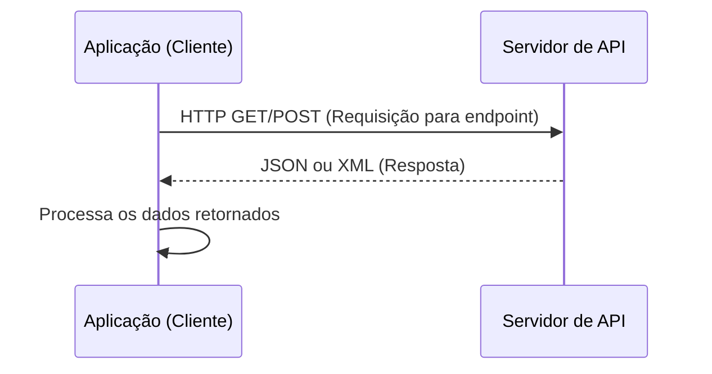

 
<p align="center">
  <a href="https://suajornadadedados.com.br/"></a>
</p>
<p align="center">
    <em>Nossa missão é fornecer o melhor ensino em engenharia de dados</em>
</p>

Bem-vindo a **Jornada de Dados**

# Extração de API do zero - Projeto completo de ETL com Python e Microsoft Azure, até o Dashboard.
Aqui está o **README** atualizado, agora usando a **API da Bitcoin na Coinbase** como referência:

---

# 💰 **Data Pipeline: Extração de Dados Bitcoin com ETL em Python**  

## **Introdução**  

Este projeto faz parte de um workshop gratuito de **Data Engineering para Iniciantes**, focado na criação de pipelines de dados ETL (Extract, Transform, Load). O objetivo é construir um programa que consome dados de uma **API** (Coinbase), organiza esses dados e armazena em uma base de dados.  

Você aprenderá conceitos fundamentais de Engenharia de Dados, como:  
1. O que é uma API e como consumi-la usando Python.  
2. O processo completo de ETL (extração, transformação e carga).  
3. Como automatizar a execução do pipeline para coleta contínua.  

Ao final do projeto, você terá um programa funcional que:  
- Coleta o preço atual da Bitcoin em tempo real.  
- Salva esses dados em um formato tabular para futura análise.  

---

## **Overview do Projeto**  

### **Objetivo Principal**  
Desenvolver um pipeline ETL automatizado para consumir dados da **API da Coinbase** e armazenar informações sobre o preço da Bitcoin ao longo do tempo.  

### **Etapas do Projeto**  

1. **Extração (E)**:  
   - Utilizar a **API da Coinbase** para obter o preço atual da Bitcoin.  
   - Trabalhar com os endpoints públicos da API (sem necessidade de autenticação).  

2. **Transformação (T)**:  
   - Selecionar apenas as informações relevantes: preço da Bitcoin, horário da consulta e moeda de referência (USD).  
   - Organizar os dados no formato tabular utilizando **Pandas**.  

3. **Carga (L)**:  
   - Armazenar os dados coletados em um arquivo **CSV** ou em um banco de dados SQLite.  

4. **Automatização**:  
   - Agendar o programa para executar periodicamente (por exemplo, a cada hora ou diariamente), garantindo a coleta contínua dos dados.  

---

## **Tecnologias Utilizadas**  
- **Python 3.8+**  
- **Bibliotecas**:  
   - `requests`: Para consumir APIs.  
   - `pandas`: Para manipulação e organização de dados.  
   - `sqlite3`: Para armazenamento em banco de dados (opcional).  
- **Coinbase API**: Para obter o preço da Bitcoin em tempo real.  

---

## **Exemplo de Dados Coletados**  
| Data/Hora           | Preço (USD) | Moeda   |  
|----------------------|------------|---------|  
| 2024-01-01 12:00:00 | 42,000.50  | Bitcoin |  
| 2024-01-01 13:00:00 | 42,150.75  | Bitcoin |  

---

## **Resultados Esperados**  
Ao final deste projeto, você será capaz de:  
1. Extrair dados em tempo real de APIs públicas.  
2. Transformar e organizar os dados em formato estruturado.  
3. Automatizar o pipeline ETL para coleta recorrente dos dados.  

**Exemplo de Análises Futuras**:  
- Monitorar o preço da Bitcoin ao longo do tempo.  
- Identificar padrões de variação diária, semanal ou mensal.  
- Criar alertas para valores mínimos/máximos.  

---

## **Próximos Passos**  
Este projeto é apenas o começo. Nos próximos módulos, cobriremos:  
1. **Transformação Avançada**: Limpeza e enriquecimento dos dados.  
2. **Armazenamento Persistente**: Introdução a bancos de dados em nuvem.  
3. **Visualização de Dados**: Construção de dashboards interativos.  

---

## **Como Executar o Projeto**  

1. **Clone o Repositório**:  
   ```bash
   git clone https://github.com/seu-usuario/data-pipeline-bitcoin.git
   cd data-pipeline-bitcoin
   ```

2. **Instale as Dependências**:  
   ```bash
   pip install requests pandas
   ```

3. **Execute o Script**:  
   ```bash
   python main.py
   ```

4. **Verifique os Dados**:  
   - O arquivo `bitcoin_prices.csv` será gerado com os preços coletados.  

---

**Agora, mãos à obra! 🚀**  

--- 

Essa versão usa a **API pública da Coinbase** e adapta o fluxo do projeto para a captura do preço da Bitcoin. Ela é simples, funcional e ideal para iniciantes em Engenharia de Dados!

## Realmente precisamos de uma API?

A grande diferença entre o **consumo de memória do Selenium** e o **consumo de memória do requests** é resultado da **complexidade** e **funcionamento interno** das duas abordagens. Vamos analisar ponto a ponto:

---

## **Diferença Entre Selenium e Requests**

1. **Selenium**:
   - **Selenium** abre um **navegador real**, como o Google Chrome.
   - O ChromeDriver **inicializa uma instância completa do navegador**, que carrega:
     - HTML completo,
     - CSS, JavaScript dinâmico,
     - Imagens e outros recursos visuais.
   - O navegador consome memória como qualquer navegador que você usaria manualmente.  
   - O **processo principal Python** apenas controla o ChromeDriver, mas a maior parte da memória é consumida pelo **processo filho** (navegador).

2. **Requests**:
   - A biblioteca **`requests`** faz apenas uma **requisição HTTP simples** ao servidor.
   - Ele **não carrega imagens, CSS, JavaScript ou renderiza nada**. Apenas recebe o **HTML cru ou JSON** como texto e o processa.  
   - Como resultado, o consumo de memória é extremamente baixo, pois não há dependências complexas ou renderização.

---

## **Resultados Explicados**

### **Selenium**
```plaintext
🔍 Memória inicial: 33.39 MB
📈 Memória após abrir o navegador: 587.02 MB
📈 Memória após carregar a página: 967.70 MB
💰 Preço atual do Bitcoin (InfoMoney): 655.084,00
📈 Memória após captura do preço: 963.44 MB
🔻 Memória final após fechar o navegador: 21.14 MB
🚀 Pico de memória do processo Python: 0.56 MB
```

**Explicação**:
- **33 MB**: Memória inicial do Python, apenas carregando o interpretador e bibliotecas.
- **587 MB**: O navegador foi aberto, e ele sozinho consome cerca de **500 MB** para funcionar.
- **967 MB**: A página foi carregada com todos os recursos (scripts, imagens, etc.).
- **Pico do Python (0.56 MB)**: O Selenium apenas **controla o navegador**, mas não aloca muito dentro do Python. O **navegador Chrome** (processo filho) consome a maior parte dos recursos.

---

### **Requests**
```plaintext
Pico de memória durante a execução: 0.17 MB
```

**Explicação**:
- A biblioteca `requests` apenas faz uma **requisição leve** e recebe uma resposta.  
- Como não há renderização ou recursos pesados sendo carregados, o consumo de memória é **mínimo**.  
- O pico de memória é extremamente baixo porque o Python armazena apenas o JSON (ou HTML) da resposta, que ocupa poucos KBs.

---

## **Por Que Essa Diferença Acontece?**

| Aspecto                   | Selenium                               | Requests                   |
|---------------------------|----------------------------------------|----------------------------|
| **Execução**              | Abre um navegador completo (Chrome).   | Apenas faz uma requisição. |
| **Carregamento**          | Renderiza HTML, CSS, JavaScript, etc.  | Processa apenas o texto.   |
| **Processo Controlado**   | Processos filhos consomem memória.     | Apenas processo Python.    |
| **Complexidade**          | Mais pesado devido ao ChromeDriver.    | Muito leve e direto.       |
| **Pico de Memória Python**| Baixo: Python controla o ChromeDriver. | Leve: Apenas resposta HTTP.|

---

## **Conclusão**

1. **Selenium**:
   - É **muito mais pesado** porque ele abre e controla um navegador completo.
   - O ChromeDriver e o navegador Chrome (processos filhos) consomem quase **1 GB** de RAM.

2. **Requests**:
   - É **muito mais leve** porque apenas faz uma requisição HTTP.
   - Não há renderização ou carregamento de recursos extras, então o consumo é quase insignificante.

---

### **Quando Usar Cada Um?**

- **Use Requests**:
   - Quando o site oferece uma **API** ou os dados estão disponíveis diretamente no HTML sem necessidade de renderização dinâmica.

- **Use Selenium**:
   - Quando o site carrega conteúdo com **JavaScript** ou é necessário interagir com o navegador (cliques, scroll, etc.).

---

Se precisar otimizar ou escolher a melhor abordagem para um caso específico, é só avisar! 🚀

Quando você entra em um **site** ou consome uma **API**, a comunicação entre o **cliente** (navegador ou aplicativo) e o **servidor** ocorre por meio de requisições e respostas. A **diferença principal** está no **conteúdo** enviado e recebido.

---

## **1. Diferença Entre Site e API**

| **Aspecto**           | **Site**                                | **API**                               |
|------------------------|----------------------------------------|--------------------------------------|
| **Requisição**         | Feita pelo navegador (HTTP GET/POST).  | Feita pelo cliente (aplicação/script) via HTTP. |
| **Resposta do Servidor**| HTML, CSS, JavaScript e recursos visuais (imagens, vídeos). | Dados estruturados (geralmente JSON ou XML). |
| **Renderização**       | Navegador renderiza a página (front-end visual). | Cliente processa os dados e decide o uso. |
| **Uso**                | Visualização para um usuário humano.   | Integração entre sistemas ou aplicações. |

---

## **2. Exemplos Práticos**

1. **Site**:  
   - O cliente (navegador) envia uma **requisição HTTP GET** para acessar a URL de um site.
   - O servidor responde com um **HTML** que contém links para **CSS, JavaScript e imagens**.  
   - O navegador **renderiza** todos esses arquivos para exibir a página.

2. **API**:  
   - O cliente (aplicação) envia uma **requisição HTTP GET/POST** para a URL da API.
   - O servidor responde apenas com **dados estruturados** (exemplo: JSON ou XML).  
   - Não há renderização visual; a resposta é processada diretamente pelo código.

---

## **3. Fluxo no Mermaid**

Aqui está o fluxo dos dois casos no formato **Mermaid**.

### **Fluxo de um Site**


---

### **Fluxo de uma API**


---

## **Diferenças Claras nos Fluxos**

1. **Site**:  
   - O servidor envia um **HTML** que o navegador processa e renderiza.
   - O HTML referencia **CSS**, **JavaScript**, e **imagens**, que são carregados separadamente.

2. **API**:  
   - O servidor retorna apenas **dados estruturados** em **JSON/XML**.
   - A aplicação cliente consome e processa esses dados diretamente, sem renderização visual.

---

Se quiser, posso ajustar o fluxo para adicionar mais detalhes ou exemplos práticos. 🚀